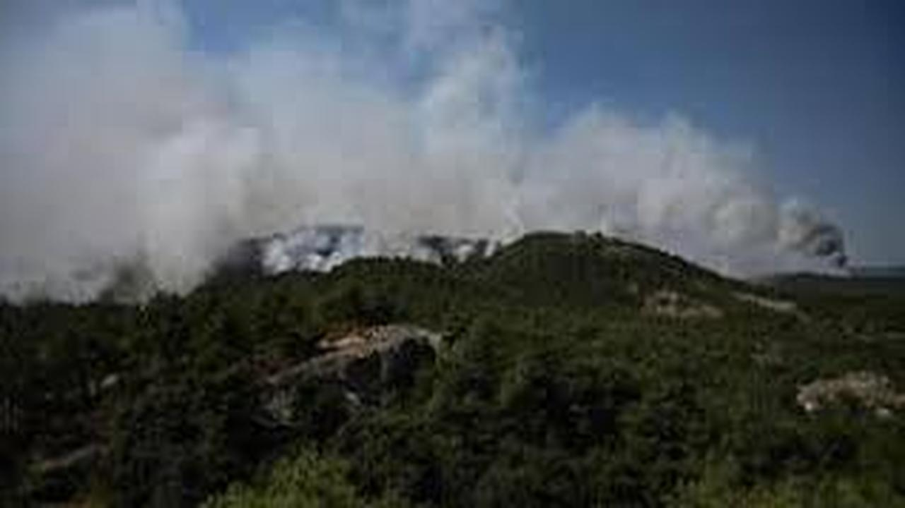

# fire-detection
A classification model to detect fire in forest.




Image 1: Prob feux : 1.0, Prob pas feux : 0.0. | Image 2: Prob feux : 0.0, Prob pas feux : 1.0


## Dataset

The dataset should be in the following structure:

```
data/
  firelookout/
    img/
      fire/
        fire1.jpg
        fire2.jpg
        ...
      no_fire/
        no_fire1.jpg
        no_fire2.jpg
        ...
  images.csv
```

## Usage

To train the model, run the following command:

```
python train.py
```

To test the model, run the following command:

```
python inference.py
```

## Setup

To install the required packages, run the following command:

```
pip install -r requirements.txt
```

## License

This project is licensed under the MIT License - see the [LICENSE](LICENSE) file for details.